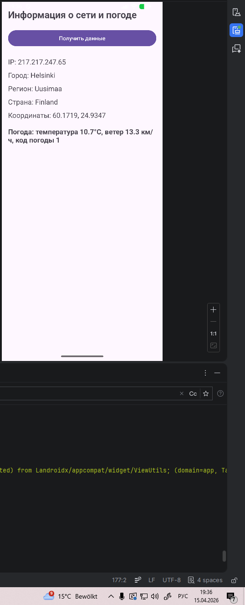
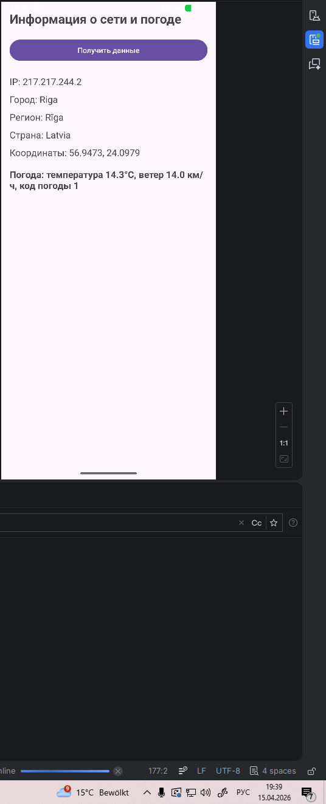

# Практическая работа № 7

**Дисциплина:** Разработка мобильных приложений  
**Тема:** Сетевое взаимодействие в Android и Firebase Authentication  
**Язык реализации:** Kotlin

## Описание

В репозитории собраны учебные Android-модули, посвященные трем способам работы с сетью и удаленными сервисами:

- получение времени через `Socket`;
- выполнение HTTP-запросов через `HttpURLConnection`;
- аутентификация пользователя через `Firebase Authentication`.

Отдельной важной частью работы является контрольное задание в соседнем проекте `MireaProject`, где эти подходы интегрируются в более крупное приложение.

## Состав проекта

| Модуль | Назначение |
| --- | --- |
| `timeservice` | Подключение к `time.nist.gov` по сокету и отображение даты и времени. |
| `httpurlconnection` | Получение внешнего IP, геоданных и текущей погоды через HTTP API. |
| `firebaseauth` | Регистрация, вход, выход и верификация почты через Firebase. |
| `app` | Базовый шаблонный модуль Android-проекта. |

## Цель работы

Изучить базовые способы сетевого взаимодействия в Android-приложениях и применить их на практике:

- подключение к сетевому ресурсу через `Socket`;
- выполнение HTTP-запросов через `HttpURLConnection`;
- разбор JSON-ответов;
- использование `Firebase Authentication` для регистрации и входа пользователя.

## Реализованные задания

### 1. TimeService

Модуль `timeservice` реализует подключение к серверу `time.nist.gov` по порту `13`.

Что сделано:

- создан экран с кнопкой загрузки времени;
- выполнено подключение к серверу в отдельном потоке;
- получен ответ от NIST Time Server;
- время из UTC преобразуется в московский часовой пояс;
- дата и время отображаются на экране;
- при ошибке выводится сообщение и сбрасываются значения.

Основные используемые классы:

- `Socket`
- `BufferedReader`
- `SimpleDateFormat`
- `TimeZone`

Ключевые файлы:

- [`MainActivity.kt`](timeservice/src/main/java/ru/mirea/kornilovku/timeservice/MainActivity.kt)
- [`SocketUtils.kt`](timeservice/src/main/java/ru/mirea/kornilovku/timeservice/SocketUtils.kt)
- [`activity_main.xml`](timeservice/src/main/res/layout/activity_main.xml)
- [`AndroidManifest.xml`](timeservice/src/main/AndroidManifest.xml)

### 2. HttpURLConnection

Модуль `httpurlconnection` демонстрирует работу с HTTP API без сторонних сетевых библиотек.

Что сделано:

- проверяется наличие активного интернет-соединения;
- через `http://ip-api.com/json/` определяется внешний IP-адрес и местоположение устройства;
- JSON-ответ разбирается через `JSONObject`;
- по координатам выполняется запрос к `https://api.open-meteo.com/`;
- на экран выводятся IP, город, регион, страна, координаты и текущая погода;
- при ошибках отображается понятное состояние интерфейса.

Основные используемые классы:

- `HttpURLConnection`
- `URL`
- `InputStream`
- `BufferedReader`
- `JSONObject`

Ключевые файлы:

- [`MainActivity.kt`](httpurlconnection/src/main/java/ru/mirea/kornilovku/httpurlconnection/MainActivity.kt)
- [`activity_main.xml`](httpurlconnection/src/main/res/layout/activity_main.xml)
- [`AndroidManifest.xml`](httpurlconnection/src/main/AndroidManifest.xml)

#### Скриншоты HttpURLConnection

| Пример 1 | Пример 2 |
| --- | --- |
|  |  |

### 3. FirebaseAuth

Модуль `firebaseauth` реализует базовый сценарий аутентификации через Firebase.

Что сделано:

- регистрация пользователя по `email/password`;
- вход в существующий аккаунт;
- выход из аккаунта;
- отправка письма для подтверждения email;
- ручное обновление статуса пользователя;
- динамическое изменение интерфейса в зависимости от состояния авторизации.

Основные используемые классы:

- `FirebaseAuth`
- `FirebaseUser`

Ключевые файлы:

- [`MainActivity.kt`](firebaseauth/src/main/java/ru/mirea/kornilovku/firebaseauth/MainActivity.kt)
- [`activity_main.xml`](firebaseauth/src/main/res/layout/activity_main.xml)
- [`AndroidManifest.xml`](firebaseauth/src/main/AndroidManifest.xml)

### 4. Контрольное задание в MireaProject

В рамках практической работы была выполнена интеграция сетевого и авторизационного функционала в проект `MireaProject`, который находится рядом с текущим репозиторием в каталоге `../MireaProject`.

Что сделано:

- добавлен отдельный экран входа и регистрации через Firebase;
- `LoginActivity` назначен стартовым экраном приложения;
- после успешной авторизации выполняется переход в `MainActivity`;
- в `ProfileFragment` выведены email пользователя, статус верификации и кнопки управления аккаунтом;
- реализованы отправка письма подтверждения, обновление статуса и выход из аккаунта;
- в навигацию добавлен экран `Сетевые данные`;
- создан `NetworkFragment`, который загружает IP, страну, провайдера, координаты и текущую погоду;
- сетевой экран в `MireaProject` реализован через `Retrofit` и `GsonConverterFactory`.

Ключевые файлы:

- [`LoginActivity.kt`](../MireaProject/app/src/main/java/ru/mirea/kornilovku/mireaproject/LoginActivity.kt)
- [`MainActivity.kt`](../MireaProject/app/src/main/java/ru/mirea/kornilovku/mireaproject/MainActivity.kt)
- [`ProfileFragment.kt`](../MireaProject/app/src/main/java/ru/mirea/kornilovku/mireaproject/ui/ProfileFragment.kt)
- [`NetworkFragment.kt`](../MireaProject/app/src/main/java/ru/mirea/kornilovku/mireaproject/ui/network/NetworkFragment.kt)
- [`activity_login.xml`](../MireaProject/app/src/main/res/layout/activity_login.xml)
- [`fragment_network.xml`](../MireaProject/app/src/main/res/layout/fragment_network.xml)
- [`mobile_navigation.xml`](../MireaProject/app/src/main/res/navigation/mobile_navigation.xml)
- [`AndroidManifest.xml`](../MireaProject/app/src/main/AndroidManifest.xml)

## Используемые технологии

- Kotlin
- Android SDK
- `Socket API`
- `HttpURLConnection`
- `org.json.JSONObject`
- Retrofit
- Firebase Authentication
- JSON API (`ip-api.com`, `open-meteo.com`)

## Как запустить

1. Откройте проект в Android Studio.
2. Дождитесь синхронизации Gradle.
3. Для модуля `firebaseauth` убедитесь, что файл `google-services.json` подключен корректно.
4. Выберите нужный модуль и запустите его на эмуляторе или устройстве.

## Итог

В рамках работы были реализованы три учебных модуля и отдельное контрольное задание в `MireaProject`:

- сетевое подключение через `Socket`;
- HTTP-запросы и разбор JSON через `HttpURLConnection`;
- аутентификация пользователя через Firebase.
- интеграция авторизации и сетевого экрана в `MireaProject`.

Проект показывает базовые подходы к работе с сетью в Android и может использоваться как учебная база для дальнейших лабораторных и практических заданий.
