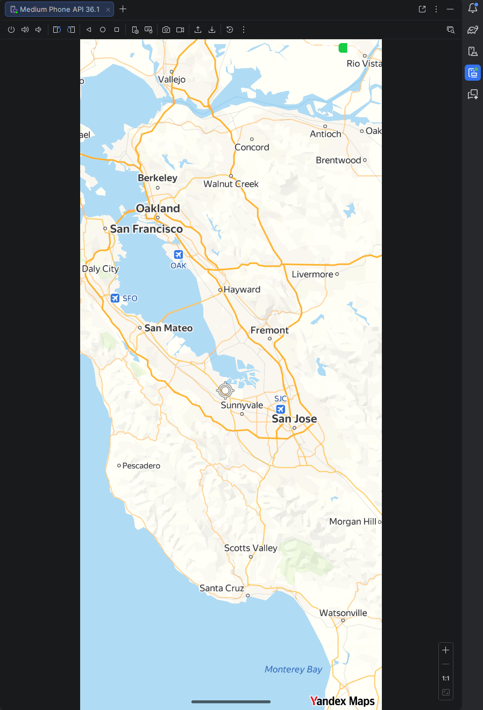
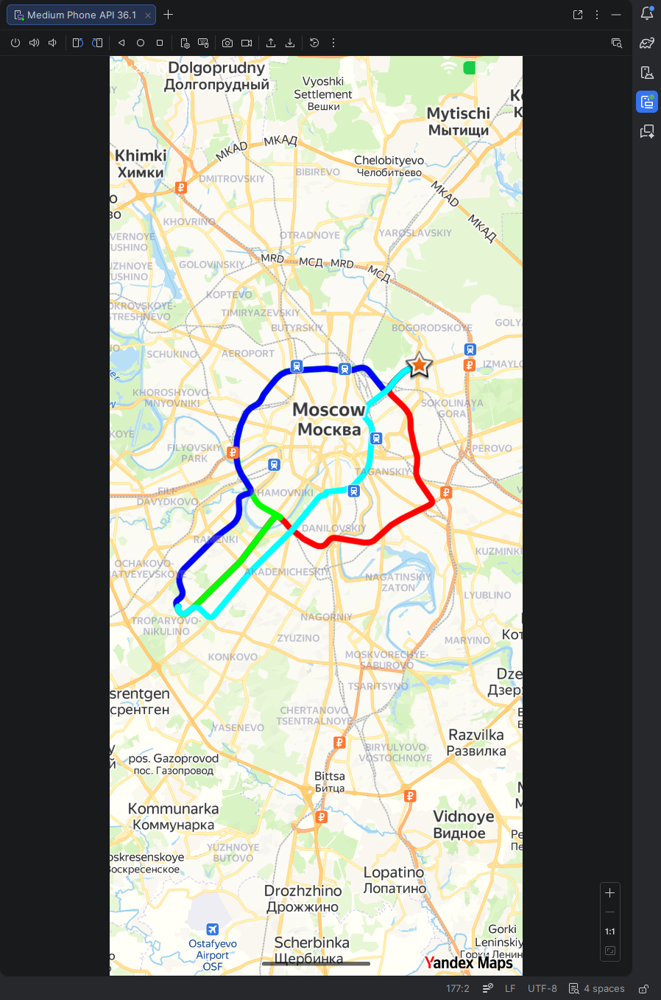
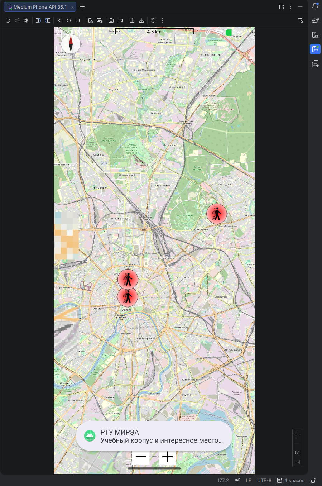

# Отчёт по практической работе № 8

**Дисциплина:** Разработка мобильных приложений  
**Тема:** Картографические сервисы в Android-приложениях  
**Язык реализации:** Kotlin

## Содержание

- [1. Цель работы](#1-цель-работы)
- [2. Постановка задач](#2-постановка-задач)
- [3. Теоретические сведения](#3-теоретические-сведения)
- [4. Ход выполнения работы](#4-ход-выполнения-работы)
- [5. Вывод](#5-вывод)

## 1. Цель работы

Целью практической работы является изучение способов интеграции картографических сервисов в Android-приложение, освоение работы с картами, геолокацией пользователя, маркерами, дополнительными картографическими элементами и построением маршрутов. В рамках практики № 8 были рассмотрены интеграция `YandexMaps`, работа с местоположением пользователя, маршрутизация, `OpenStreetMap`, а также контрольное задание в `MireaProject`.

## 2. Постановка задач

В ходе практической работы требовалось:

1. Изучить основные картографические сервисы, используемые в мобильной разработке.
2. Создать модуль `YandexMaps`, подключить `Yandex MapKit`, вывести карту на экран и установить начальное положение камеры.
3. Добавить в `YandexMaps` определение местоположения пользователя: запрос разрешений, слой позиции пользователя, иконку направления и круг точности координат.
4. Создать модуль `YandexDriver` и реализовать построение маршрута движения между двумя точками с несколькими альтернативами, а также добавить маркер конечной точки с кратким описанием.
5. Создать модуль `OSMMaps`, подключить `osmdroid`, реализовать отображение карты, местоположения пользователя, компаса, шкалы масштаба и маркеров с описанием.
6. Выполнить контрольное задание в `MireaProject`: создать фрагмент «Заведения», разместить на карте разные заведения, по нажатию на маркер показывать адрес и краткое описание, а также добавить дополнительную функцию работы с картой.

## 3. Теоретические сведения

### 3.1. Картографические сервисы

В мобильной разработке часто используются следующие картографические сервисы:

- `Google Maps`
- `Apple Maps`
- `Яндекс Карты`
- `HERE`
- `OpenStreetMap`
- `Azure Maps`
- `ArcGIS`
- `2ГИС`

Выбор картографической платформы зависит от региона использования, требований к маршрутизации, наличия офлайн-режима, поддержки пользовательских слоёв и особенностей лицензирования. Для России и стран СНГ особенно распространены сервисы Яндекса, а для международных решений чаще применяются карты Google.

### 3.2. Yandex MapKit

`Yandex MapKit` используется для интеграции картографического сервиса Яндекса в Android-приложение. Для работы с ним требуется:

- получить API-ключ;
- подключить библиотеку через `mavenCentral()`;
- добавить зависимость `com.yandex.android:maps.mobile:4.3.1-full`;
- создать класс `Application` и передать ключ в `MapKitFactory.setApiKey(...)`;
- добавить `MapView` в разметку;
- инициализировать карту в `MainActivity`;
- корректно обрабатывать жизненный цикл через `onStart()` и `onStop()`.

### 3.3. Определение местоположения пользователя

Для определения местоположения пользователя необходимо:

- указать разрешения `ACCESS_COARSE_LOCATION` и `ACCESS_FINE_LOCATION`;
- запросить разрешения во время выполнения;
- создать слой местоположения через `createUserLocationLayer(...)`;
- реализовать `UserLocationObjectListener`;
- настроить отображение позиции пользователя, стрелки направления и круга точности.

### 3.4. Построение маршрута

Для маршрутизации в `Yandex MapKit` используется `DrivingRouter`. Основные шаги:

- подключить модуль маршрутизации;
- реализовать `DrivingSession.DrivingRouteListener`;
- задать стартовую и конечную точки;
- отправить запрос на построение маршрута;
- получить список маршрутов и отобразить их на карте;
- обработать возможные ошибки построения.

### 3.5. OpenStreetMap и osmdroid

`OpenStreetMap` представляет собой открытый картографический сервис, а библиотека `osmdroid` позволяет использовать его в Android-приложении. Для этого требуется:

- добавить сетевые и геолокационные разрешения;
- подключить `org.osmdroid:osmdroid-android:6.1.16`;
- подключить `androidx.preference:preference:1.2.0`;
- использовать `MapView`;
- настроить `Configuration`;
- добавить масштабирование, multitouch, местоположение пользователя, компас, шкалу масштаба и маркеры.

## 4. Ход выполнения работы

### 4.1. Задание 1. YandexMaps

#### Постановка задачи

Требовалось создать модуль `YandexMaps`, подключить `Yandex MapKit`, добавить карту в layout, создать `Application`-класс и отобразить карту на экране с начальным положением камеры.

#### Листинги

- [yandexmaps/build.gradle.kts](yandexmaps/build.gradle.kts) — подключение `Yandex MapKit`.
- [yandexmaps/src/main/res/layout/activity_main.xml](yandexmaps/src/main/res/layout/activity_main.xml) — разметка экрана с `MapView`.
- [yandexmaps/src/main/java/ru/mirea/kornilovku/yandexmaps/App.kt](yandexmaps/src/main/java/ru/mirea/kornilovku/yandexmaps/App.kt) — инициализация API-ключа.
- [yandexmaps/src/main/AndroidManifest.xml](yandexmaps/src/main/AndroidManifest.xml) — разрешения и регистрация приложения.
- [yandexmaps/src/main/java/ru/mirea/kornilovku/yandexmaps/MainActivity.kt](yandexmaps/src/main/java/ru/mirea/kornilovku/yandexmaps/MainActivity.kt) — запуск карты и установка камеры.

#### Что сделано

Был создан модуль `YandexMaps`, подключён `MapKit`, настроена инициализация через `Application`, добавлен `MapView` в разметку и выполнено отображение карты с начальным положением камеры.

### 4.2. Задание 2. Определение местоположения в YandexMaps

#### Постановка задачи

Требовалось добавить определение местоположения пользователя: запрос разрешений, `UserLocationObjectListener`, слой пользователя, иконку направления и круг точности.

#### Листинги

- [yandexmaps/src/main/AndroidManifest.xml](yandexmaps/src/main/AndroidManifest.xml) — разрешения `ACCESS_COARSE_LOCATION` и `ACCESS_FINE_LOCATION`.
- [yandexmaps/src/main/java/ru/mirea/kornilovku/yandexmaps/MainActivity.kt](yandexmaps/src/main/java/ru/mirea/kornilovku/yandexmaps/MainActivity.kt) — запрос разрешений, настройка слоя пользователя, стрелки и круга точности.

#### Что сделано

После выдачи разрешения на местоположение на карте появился слой пользователя, отображающий текущую позицию устройства, иконку направления и круг точности.

#### Иллюстрация

### 4.3. Задание 3. YandexDriver

#### Постановка задачи

Требовалось создать модуль `YandexDriver`, реализовать построение маршрута с помощью `DrivingRouter`, отобразить несколько маршрутов разными цветами и добавить маркер конечной точки с краткой информацией о месте назначения.

#### Листинги

- [yandexdriver/build.gradle.kts](yandexdriver/build.gradle.kts) — подключение библиотеки `MapKit`.
- [yandexdriver/src/main/res/layout/activity_main.xml](yandexdriver/src/main/res/layout/activity_main.xml) — экран с картой.
- [yandexdriver/src/main/java/ru/mirea/kornilovku/yandexdriver/App.kt](yandexdriver/src/main/java/ru/mirea/kornilovku/yandexdriver/App.kt) — инициализация API-ключа.
- [yandexdriver/src/main/AndroidManifest.xml](yandexdriver/src/main/AndroidManifest.xml) — разрешения и регистрация приложения.
- [yandexdriver/src/main/java/ru/mirea/kornilovku/yandexdriver/MainActivity.kt](yandexdriver/src/main/java/ru/mirea/kornilovku/yandexdriver/MainActivity.kt) — построение альтернативных маршрутов и добавление маркера назначения.

#### Что сделано

В модуле `YandexDriver` было реализовано построение нескольких маршрутов от стартовой точки до выбранного места назначения. На карте отображаются альтернативные маршруты разными цветами, а в конечной точке размещён маркер с кратким описанием.

#### Иллюстрация

### 4.4. Задание 4. OSMMaps

#### Постановка задачи

Требовалось создать модуль `OSMMaps`, подключить `osmdroid`, настроить отображение карты, добавить масштабирование, multitouch, местоположение пользователя, компас, шкалу масштаба и маркеры.

#### Листинги

- [osmmaps/build.gradle.kts](osmmaps/build.gradle.kts) — зависимости `osmdroid` и `preference`.
- [osmmaps/src/main/AndroidManifest.xml](osmmaps/src/main/AndroidManifest.xml) — сетевые и геолокационные разрешения.
- [osmmaps/src/main/res/layout/activity_main.xml](osmmaps/src/main/res/layout/activity_main.xml) — разметка с `MapView`.
- [osmmaps/src/main/java/ru/mirea/kornilovku/osmmaps/MainActivity.kt](osmmaps/src/main/java/ru/mirea/kornilovku/osmmaps/MainActivity.kt) — настройка карты, компаса, шкалы масштаба, геолокации и маркеров.

#### Что сделано

В модуле `OSMMaps` была интегрирована карта `OpenStreetMap`, добавлены масштабирование, multitouch, текущее местоположение пользователя, компас, шкала масштаба и несколько маркеров с описанием.

#### Иллюстрация

### 4.5. Контрольное задание в MireaProject

#### Постановка задачи

В `MireaProject` требовалось создать новый фрагмент «Заведения», показать на карте различные заведения, при нажатии на маркер выводить адрес и краткое описание, а также добавить одну дополнительную функцию работы с картой.

#### Листинги

Файлы `MireaProject`:

- [fragment_places.xml](../MireaProject/app/src/main/res/layout/fragment_places.xml) — разметка фрагмента «Заведения».
- [PlacesFragment.kt](../MireaProject/app/src/main/java/ru/mirea/kornilovku/mireaproject/ui/PlacesFragment.kt) — логика карты, геолокации, компаса и маркеров.
- [navigation_drawer.xml](../MireaProject/app/src/main/res/menu/navigation_drawer.xml) — пункт меню для перехода к фрагменту.
- [mobile_navigation.xml](../MireaProject/app/src/main/res/navigation/mobile_navigation.xml) — регистрация `PlacesFragment` в графе навигации.

#### Что сделано

Для реализации был выбран `OpenStreetMap` через `osmdroid`, так как он не требует внешнего API-ключа и уже был освоен в основной части практики.

В `MireaProject` был добавлен новый фрагмент «Заведения», где:

- отображаются несколько мест на карте;
- по нажатию на маркер выводятся адрес и краткое описание;
- дополнительно используются текущее местоположение пользователя, компас и шкала масштаба.

Это полностью соответствует контрольному заданию практики № 8.

## 5. Вывод

В ходе выполнения практической работы были изучены и реализованы основные способы интеграции картографических сервисов в Android-приложения. Были рассмотрены популярные картографические платформы, выполнена интеграция `YandexMaps`, реализовано определение местоположения пользователя, построение маршрутов, подключён `OpenStreetMap` через `osmdroid`, а также описано выполнение контрольного задания в `MireaProject`.

В результате выполнения работы были получены практические навыки работы с:

- `Yandex MapKit`;
- геолокацией пользователя;
- `DrivingRouter` и маршрутизацией;
- `OpenStreetMap`;
- `osmdroid`;
- маркерами, компасом и шкалой масштаба;
- интеграцией карты в основной проект `MireaProject`.

Таким образом, все основные задания практики № 8 были выполнены.
